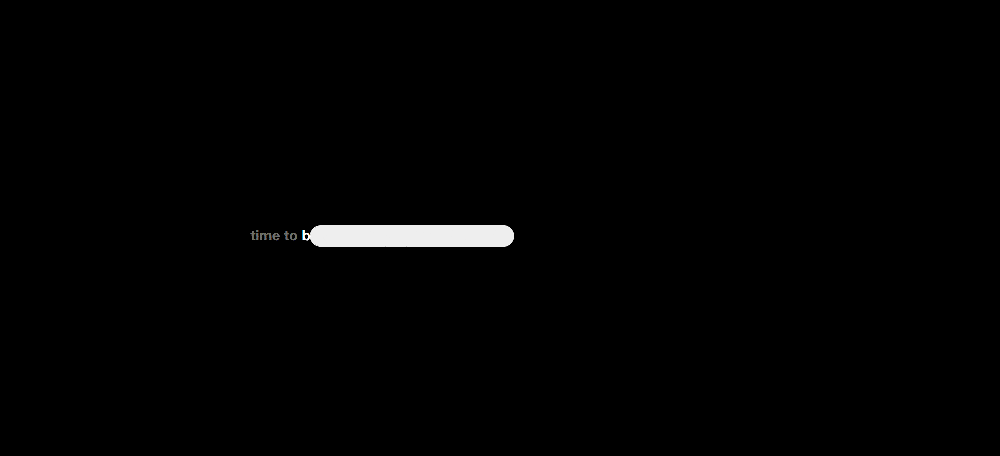
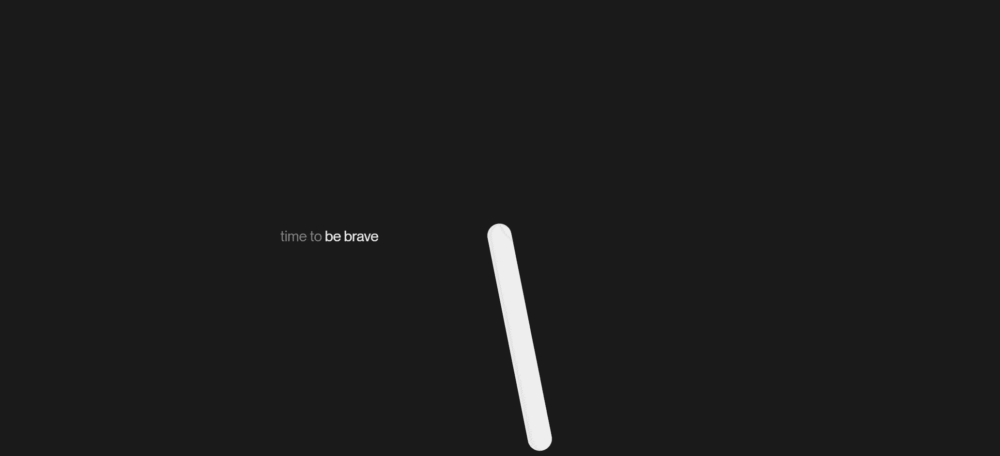

# DAY_015 | Scroll Animation with GSAP, ScrollTrigger, and Lenis

This project is part of my daily code challenge series, **DAY_015**, where I explore creating **scroll-triggered animations**. The project uses **GSAP**, **ScrollTrigger**, and **Lenis** to create smooth scrolling interactions that reveal and animate content as the user scrolls through the page. The animation features dynamic transitions, rotating elements, and smooth scrolling behavior.

## Inspiration

This project was inspired by the **Samuel Siebler Website** (**Time to Meet Sam**) (Honorable Mention on Awwwards). I wanted to replicate the smooth, interactive scroll animations seen on these sites using **GSAP** and **Lenis** for smooth scrolling and animation control.

---

## Project Preview



## Time to Meet Sam



---

## GSAP in Action

### What is GSAP?

**GSAP (GreenSock Animation Platform)** is a powerful JavaScript library used to create high-performance animations with smooth, precise control. It is widely used for advanced animations, including scroll-triggered interactions.

### How GSAP is Used in This Project

In **DAY_015**, animations are triggered as the user scrolls through the page. The hand container rotates dynamically, and the text and images fade in or out, depending on the scroll position. The intro header changes its text and content, creating a visually engaging and interactive experience.

---

## Detailed Breakdown of the JavaScript

### Key JavaScript Code:

#### Smooth scrolling setup using Lenis

```javascript
const lenis = new Lenis();
lenis.on("scroll", ScrollTrigger.update);
gsap.ticker.add((time) => {
  lenis.raf(time * 1000);
});
gsap.ticker.lagSmoothing(0);
```

- **Lenis** is used to create smooth scrolling behavior, while **GSAP** updates the animations as the user scrolls.

#### Scroll-triggered animation

```javascript
ScrollTrigger.create({
  trigger: stickySection,
  start: "top top",
  end: `+=${pinnedHeight}`,
  pin: true,
  onUpdate: (self) => {
    const progress = self.progress;
    // Animation logic based on scroll progress
  },
});
```

- This **ScrollTrigger** setup defines the scroll-triggered behavior, pinning the section and controlling animations based on the scroll progress.

#### Dynamic header text update

```javascript
const introHeaders = [
  "<span>time to</span> be creative",
  "<span>time to</span> design the future",
  "<span>time to</span> meet thounny",
];
function updateHeaderText() {
  h1Element.innerHTML =
    introHeaders[Math.min(currentCycle, introHeaders.length - 1)];
}
```

- This function updates the header text dynamically as the user scrolls through different stages.

---

## How to Run

1. **Clone the repository**:

   ```bash
   git clone https://github.com/thounny/DAY_015.git
   ```

2. **Navigate to the project directory**:

   ```bash
   cd DAY_015
   ```

3. **Open the `index.html` file** in your web browser:

   - You can double-click the file in your file explorer, or
   - Serve it using a local development server (e.g., Live Server in VSCode).

---

## Project Structure

```bash
DAY_015/
│
├── assets/
│   └── you know the rest
│   └── favicon.ico
│   └── tone.jpg
│   └── DAY_015_1.gif
│   └── DAY_015_2.gif
├── helveticaneu.woff2
├── styles.css
├── index.html
└── script.js
```

---

## Features

- **Scroll-Triggered Animations**: Elements rotate and reveal themselves based on scroll position.
- **Dynamic Header Updates**: The intro text changes dynamically as you scroll through the page.
- **Smooth Scrolling**: Implemented using **Lenis** for a polished user experience.

---

## Technologies Used

- **HTML5**: For document structure.
- **CSS3**: For layout and styling.
- **JavaScript (ES6)**: For handling animations and scroll events.
- **GSAP (GreenSock Animation Platform)**: For creating smooth, high-performance animations.
- **Lenis**: For smooth scrolling behavior.

---

## Author


**Thounny Keo**  
Frontend Development Student | Year Up United

---


